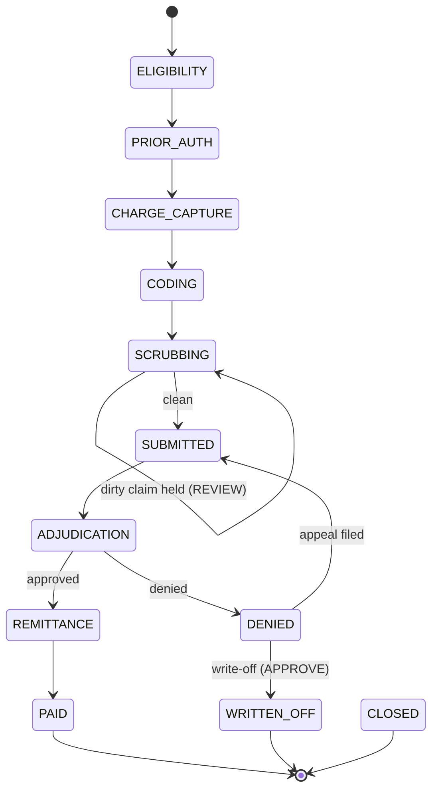

# Veebase RCM Intelligence Platform

> **Agentic-AI Revenue Cycle Management (RCM) for healthcare providers — built for the Egyptian market (NHIA, private payers, self-pay; currency EGP).**


Veebase orchestrates **12 specialized AI agents** across the revenue cycle, driving each claim through a deterministic, explainable pipeline — from eligibility verification to payment posting — while enforcing a **Human-in-the-Loop (HITL)** governance model so that nothing prohibited by policy is ever auto-executed. Every state change is written to an immutable audit trail, and the platform exposes a full **inbound + outbound integration API** (native JSON, HL7 FHIR R4, and signed webhooks).

---

## Table of Contents

- [Feature Highlights](#feature-highlights)
- [The 12 Agents](#the-12-agents)
- [Architecture Overview](#architecture-overview)
- [Quick Start](#quick-start)
- [Scripts](#scripts)
- [Environment Variables](#environment-variables)
- [Project Structure](#project-structure)
- [Integration](#integration)
- [Security & Governance](#security--governance)
- [Internationalization (i18n / RTL)](#internationalization-i18n--rtl)
- [License](#license)

---

## Feature Highlights

- **12 specialized RCM agents** across 4 categories (linear pipeline, sentinel, knowledge, analytics).
- **Deterministic RCM engine** — a pure, explainable rules engine that advances claims through the lifecycle, computes a **readiness score** and a **denial-risk score**, and applies a per-payer rule book (prior-auth thresholds, timely-filing windows, appeal windows, reimbursement rates).
- **Human-in-the-Loop governance** — `AUTO` / `REVIEW` / `APPROVE` gates. Auto-processing **stops** at any human gate. Prohibited actions (auto-accepting low-confidence coding, auto write-off, submitting a dirty claim, etc.) are never performed automatically.
- **DB-backed persistence** with Prisma + SQLite. The UI hydrates from real APIs and persists every change.
- **Integration API** — internal/UI endpoints plus a versioned external `v1` API with API-key auth, batch ingestion, FHIR R4, and outbound HMAC-signed webhooks.
- **OpenAPI 3.0 spec** at `/api/openapi.json` and **interactive Swagger UI** at `/docs`.
- **Document ingestion** — PDF → claim extraction (VLM-assisted, with template-based fallback) and hospital-specific templates.
- **Full UI** — Dashboard, Agents, Claims (with a live "Run Agents" engine button), Ingestion Hub, Escalations (5-level ladder), Audit Trail (CSV export), Payer Rules, Analytics, AI Chat, and Settings.
- **Bilingual** — English + Arabic with full right-to-left (RTL) layout flip; locale persisted to `localStorage`.

---

## The 12 Agents

| # | Agent | Display Name | Category | Role |
|---|-------|--------------|----------|------|
| 1 | `EligibilityBenefits` | Eligibility & Benefits | LINEAR | Verifies insurance coverage, benefits, copays, and demographic accuracy before service. |
| 2 | `PriorAuthorization` | Prior Authorization | LINEAR | Manages preauthorization requirements, submits auth requests, tracks approval status. |
| 3 | `ChargeCapture` | Charge Capture & Integrity | LINEAR | Identifies billable services not yet captured as charges; prevents silent under-billing. |
| 4 | `MedicalCoding` | Medical Coding | LINEAR | Proposes ICD-10 / CPT / HCPCS codes from documentation. Always requires certified-coder review. |
| 5 | `ClaimScrubSubmit` | Claim Scrubbing & Submission | LINEAR | Validates claims against payer rules, scores readiness, and submits when ready. |
| 6 | `DenialPrediction` | Denial Prediction | LINEAR | Scores denial probability before submission; catches patterns beyond rule-based scrubbing. |
| 7 | `DenialManagement` | Denial Management & Appeals | LINEAR | Classifies denials, selects appeal strategies, drafts appeals, tracks recovery. |
| 8 | `PaymentPosting` | Payment Posting & Reconciliation | LINEAR | Posts payments and detects underpayments against contracted rates. |
| 9 | `PatientBilling` | Patient Billing & Collections | LINEAR | Generates estimates and statements; manages collection follow-up (Arabic & English). |
| 10 | `FraudWasteAbuse` | Fraud, Waste & Medical Necessity | SENTINEL | Cross-cutting sentinel for upcoding, unbundling, phantom billing, and medical-necessity issues. |
| 11 | `PayerContractRules` | Payer Contract & Rules | KNOWLEDGE | Queryable knowledge service: fee schedules, auth requirements, edit libraries, appeal rules. |
| 12 | `AnalyticsReporting` | Analytics & Reporting | ANALYTICS | Computes KPIs, produces trend narratives, and performs root-cause analysis. |

**Categories**

- **LINEAR** — the sequential revenue-cycle pipeline (agents 1–9).
- **SENTINEL** — `FraudWasteAbuse`, a cross-cutting monitor invoked at high-risk points (e.g., high-value claims at submission).
- **KNOWLEDGE** — `PayerContractRules`, the contract/rule knowledge base behind the engine's payer rule book.
- **ANALYTICS** — `AnalyticsReporting`, KPI and trend computation.

---

## Architecture Overview

The platform is a layered Next.js (App Router) application. The **RCM engine is pure** (no side effects): it takes a claim snapshot and returns a proposed result. The **service layer** owns persistence, audit logging, and webhook dispatch.

```
┌──────────────────────────────────────────────────────────────────┐
│  UI  (Next.js App Router, React 19, Tailwind v4 + shadcn/ui)      │
│  Dashboard · Agents · Claims · Ingestion · Escalations · Audit ·  │
│  Payer Rules · Analytics · AI Chat · Settings   (EN / AR + RTL)   │
└───────────────┬──────────────────────────────────────────────────┘
                │  fetch
┌───────────────▼──────────────────────────────────────────────────┐
│  API LAYER  (route handlers)                                      │
│  Internal/UI:  /api/claims, /api/escalations, /api/audit, ...     │
│  External v1:  /api/v1/claims, /api/v1/eligibility, /api/v1/fhir, │
│                /api/v1/webhooks, /api/v1/keys  (API-key auth)     │
└───────────────┬──────────────────────────────────────────────────┘
                │
┌───────────────▼──────────────────────────────────────────────────┐
│  SERVICE LAYER  (src/lib/server/*)                                │
│  claim-service · auth · audit · webhooks                          │
│  Persistence · audit logging · event dispatch                    │
└───────┬──────────────────────────────┬───────────────────────────┘
        │                              │
┌───────▼─────────────────┐   ┌────────▼──────────────────────────┐
│  RCM ENGINE (pure)      │   │  PRISMA + SQLite                  │
│  src/lib/rcm-engine.ts  │   │  Claim · AgentStatus · Escalation │
│  state machine · scores │   │  KPIRecord · AuditLog · ClaimEvent│
│  payer rules · HITL     │   │  ApiKey · Webhook · WebhookDelivery│
└─────────────────────────┘   └───────────────────────────────────┘
        │  outbound events (HMAC-signed)
        ▼
   External subscribers (webhooks)
```

The claim lifecycle state machine:



See [`docs/ARCHITECTURE.md`](docs/ARCHITECTURE.md) for the full data model, scoring rules, payer rule book, HITL governance model, and event/webhook flow.

---

## Quick Start

Prerequisites: [Bun](https://bun.sh).

```bash
# 1. Install dependencies
bun install

# 2. Generate the Prisma client
bunx prisma generate

# 3. Create the database schema
bunx prisma db push

# 4. Seed demo data
#    (12 agents, 25 claims, 10 escalations, 12 KPIs, 20 audit entries)
bun run prisma/seed.ts

# 5. Run in development (port 3000)
bun run dev
```

Then open <http://localhost:3000>. The interactive API docs are at <http://localhost:3000/docs> and the OpenAPI spec at <http://localhost:3000/api/openapi.json>.

For a production build:

```bash
bun run build     # next build (standalone output)
bun run start     # serves the standalone server
```

---

## Scripts

Defined in `package.json`:

| Script | Command | Purpose |
|--------|---------|---------|
| `dev` | `next dev -p 3000` | Development server on port 3000 (logs to `dev.log`). |
| `build` | `next build` (+ copies static assets into `.next/standalone`) | Production standalone build. |
| `start` | `bun .next/standalone/server.js` | Run the standalone production server. |
| `lint` | `eslint .` | Lint the codebase. |
| `typecheck` | `tsc --noEmit` | Type-check the codebase (build errors are **not** ignored). |
| `test` | `bun test` | Run the Bun test suite (30 tests: engine, validation, sessions). |
| `db:push` | `prisma db push` | Sync the Prisma schema to the database. |
| `db:generate` | `prisma generate` | Generate the Prisma client. |
| `db:migrate` | `prisma migrate dev` | Create/apply a dev migration. |
| `db:reset` | `prisma migrate reset` | Reset the database. |
| `db:seed` | `bun run prisma/seed.ts` | Seed demo data. |

---

## Environment Variables

| Variable | Default | Description |
|----------|---------|-------------|
| `DATABASE_URL` | `file:./db/custom.db` | Database connection. A `file:` SQLite URL is resolved to an **absolute** path at runtime (`src/lib/db.ts`) so it works identically in dev, production, and the standalone build. Set a non-`file:` URL (e.g. `postgresql://…`, `mysql://…`) to point at a managed database with no code changes. |
| `RCM_DATABASE_FILE` | — | Optional override for the SQLite file location (absolute path preferred). Takes precedence over the `file:` portion of `DATABASE_URL`. |
| `RCM_MASTER_KEY` | — | Optional trusted server-to-server key. When set, it is **always** accepted on `/api/v1` routes and carries `read`, `write`, and `admin` scopes. Also used to provision the first key when API auth is required. |
| `RCM_REQUIRE_API_AUTH` | `false` | When `true`, an API key is required on `/api/v1` even when no keys are provisioned yet (disables open bootstrap mode). Provision the first key with `RCM_MASTER_KEY`. |
| `RCM_RATE_LIMIT` | `240` | Max `/api/v1` requests allowed per window, per API key (or client IP). |
| `RCM_RATE_WINDOW_MS` | `60000` | Rate-limit window length in milliseconds (default 60s). |
| `RCM_CORS_ORIGINS` | `*` | Comma-separated CORS allow-list for `/api/v1` (with OPTIONS preflight handling). |
| `RCM_WEBHOOK_MAX_ATTEMPTS` | `3` | Max delivery attempts for outbound webhooks (bounded exponential backoff). |
| `RCM_UI_USER` | `admin` | Username for the optional UI auth gate (used when `RCM_UI_PASSWORD` is set). |
| `RCM_UI_PASSWORD` | — | When set, the dashboard requires login. Unset = app is open (default). |
| `RCM_SESSION_SECRET` | — | Secret used to sign the HttpOnly UI session cookie. |

> **Note:** SQLite is the default and the schema's `datasource` provider. To use Postgres/MySQL you must also update the `provider` in `prisma/schema.prisma` and re-run `prisma generate` / `prisma db push`.

---

## Project Structure

```
RCM-AI/
├── prisma/
│   ├── schema.prisma        # Data model (9 models)
│   └── seed.ts              # Demo data seeder
├── public/
│   └── whitepaper.html      # Standalone technical & business whitepaper
├── src/
│   ├── app/
│   │   ├── api/             # Route handlers
│   │   │   ├── claims/      # Internal/UI claim APIs (+ [id]/process)
│   │   │   ├── escalations/ # Escalation queue
│   │   │   ├── audit/       # Audit trail
│   │   │   ├── agents/  kpis/  dashboard/  chat/  ingest/  health/
│   │   │   ├── openapi.json/ # OpenAPI 3.0 spec
│   │   │   └── v1/          # External API (claims, eligibility, fhir,
│   │   │                    #   webhooks, keys)
│   │   └── docs/            # Interactive Swagger UI (route handler)
│   └── lib/
│       ├── rcm-engine.ts    # Pure deterministic engine (state machine,
│       │                    #   scoring, payer rules, HITL gates)
│       ├── rcm-data.ts      # 12 agents, KPIs, appeal strategies, templates
│       ├── rcm-types.ts     # Shared types
│       ├── db.ts            # Prisma client + DB URL resolution
│       ├── server/          # Service layer
│       │   ├── claim-service.ts  # create/list/update/process claims
│       │   ├── auth.ts           # API-key auth & bootstrap mode
│       │   ├── audit.ts          # immutable audit writer
│       │   └── webhooks.ts       # outbound signed event dispatch
│       └── i18n/            # English + Arabic translations, RTL
└── docs/
    ├── ARCHITECTURE.md      # System architecture deep-dive
    ├── INTEGRATION.md       # Complete integration guide
    └── API.md              # Endpoint cheat-sheet
```

---

## Integration

The platform exposes both **internal/UI** endpoints and a versioned **external `v1`** API for inbound submission and outbound events.

- **Authentication** uses an API key sent as `X-API-Key: <key>` or `Authorization: Bearer <key>`. While **no keys exist**, the gateway runs in an **open bootstrap mode**; once the first key is created via `POST /api/v1/keys`, auth is **enforced** on all `/api/v1` routes. An `RCM_MASTER_KEY` env var is always accepted.
- **Inbound:** create claims (single, batch, or HL7 FHIR R4), run the agent pipeline, and check eligibility.
- **Outbound:** register webhooks to receive HMAC-signed lifecycle events (`claim.created`, `claim.denied`, `claim.paid`, `escalation.created`, …).
- **Specs:** OpenAPI 3.0 at `GET /api/openapi.json`; interactive Swagger UI at `GET /docs`.

See the full guide in [`docs/INTEGRATION.md`](docs/INTEGRATION.md) and the endpoint cheat-sheet in [`docs/API.md`](docs/API.md).

---

## Security & Governance

- **Human-in-the-Loop (HITL) gates** — every agent step carries a gate of `AUTO`, `REVIEW`, or `APPROVE`. Automated processing (`processToGate`) advances only through `AUTO` steps and **stops** the moment a step requires a human.
- **Prohibited actions are never auto-executed.** Enforced by the Phase-1 governance model:
  - No auto-accept of low-confidence coding — routed to a certified coder (`REVIEW`).
  - No auto write-off — write-offs require human approval (`APPROVE`).
  - Dirty claims (failed scrubber edits) are **held** at scrubbing, never submitted.
  - High-value claims (> 50,000 EGP) are flagged to the Fraud/Waste/Abuse sentinel and gated to `APPROVE` before submission.
- **Immutable audit trail** — every create, status change, agent run, escalation, and HITL action is appended to `AuditLog` with actor, role, risk level, before/after values, and source (`ui` / `api` / `engine` / `webhook`). The Audit Trail UI supports CSV export.
- **API-key scopes** — `read`, `write`, `admin`. Key secrets are stored only as SHA-256 hashes and shown in plaintext exactly once at creation. Webhook signing secrets are likewise returned once.

See [`docs/ARCHITECTURE.md`](docs/ARCHITECTURE.md#human-in-the-loop-governance) for the complete governance model.

### Production Hardening

- **Request validation (Zod)** — every `/api/v1` write endpoint validates its body and returns **HTTP 422** with `{ error: "Validation failed", issues: [{ path, message }] }` on bad input. Claim create accepts a single object, a raw array, or `{ claims: [...] }`.
- **Rate limiting** — per API key (or client IP) token bucket on `/api/v1`, default **240 requests / 60s** (configurable via `RCM_RATE_LIMIT` / `RCM_RATE_WINDOW_MS`). On exceed returns **429** with `Retry-After`, `X-RateLimit-Limit`, `X-RateLimit-Remaining`, and `X-RateLimit-Reset`. All API responses carry an `X-Request-Id` correlation header.
- **CORS** — configurable allow-list for `/api/v1` via `RCM_CORS_ORIGINS` (comma-separated, default `*`), with proper OPTIONS preflight handling.
- **Security headers** — applied globally via `next.config`: `X-Content-Type-Options: nosniff`, `X-Frame-Options: SAMEORIGIN`, `Referrer-Policy: strict-origin-when-cross-origin`, and `Permissions-Policy`.
- **Idempotency keys** — single claim create (`POST /api/v1/claims`) honors an `Idempotency-Key` request header; repeating the same key (scoped per API key) returns the original claim instead of creating a duplicate.
- **Webhook reliability** — deliveries retry with bounded exponential backoff (default 3 attempts, `RCM_WEBHOOK_MAX_ATTEMPTS`) and run in the background so they never block the API response. Inspect recent attempts via `GET /api/v1/webhooks/{id}/deliveries` and send a signed `ping` via `POST /api/v1/webhooks/{id}/test`.
- **Configurable API auth** — set `RCM_REQUIRE_API_AUTH=true` to require an API key on `/api/v1` even before any key is provisioned (disables open bootstrap mode); provision the first key with `RCM_MASTER_KEY`.
- **Optional UI auth gate** — when `RCM_UI_PASSWORD` is set, the dashboard requires login (`/login` page, `POST /api/auth/login`, `POST /api/auth/logout`, `GET /api/auth/session`, HttpOnly signed-cookie session). Unset = open by default.
- **Automated tests + CI** — the codebase type-checks cleanly (`ignoreBuildErrors` is off), ships a Bun test suite (`bun test`, 30 tests), and a GitHub Actions workflow (`.github/workflows/ci.yml`) runs install → prisma generate → db push → lint → typecheck → test → build.

---

## Internationalization (i18n / RTL)

The UI ships with **English** and **Arabic** translations and a full **right-to-left** layout flip. The selected locale is persisted to `localStorage` (`veebase-locale`) and applied via `document.documentElement.dir` / `lang`. The implementation is a lightweight custom context provider (`src/lib/i18n`).

---

## License

MIT.
