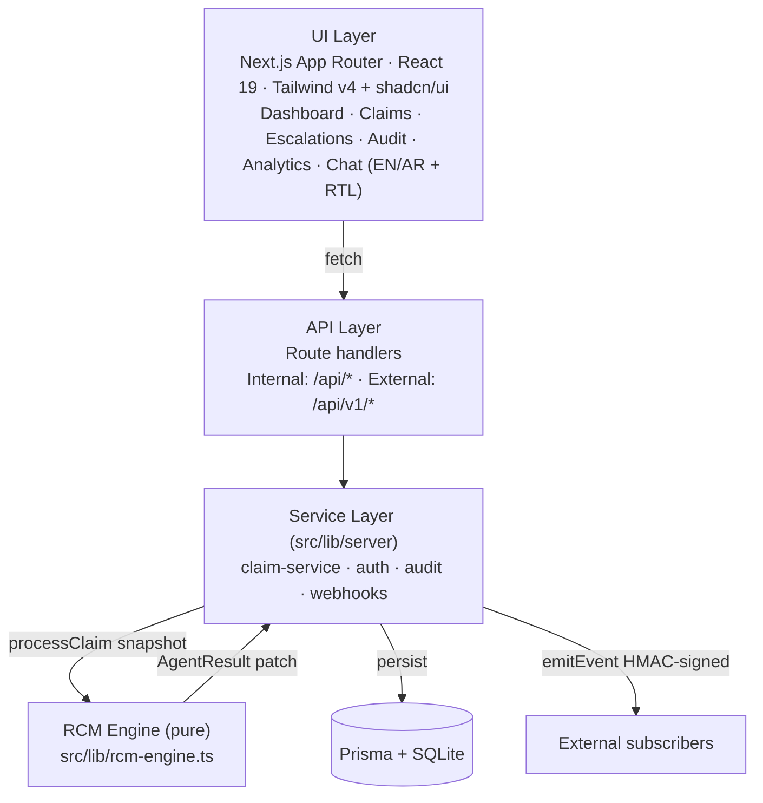
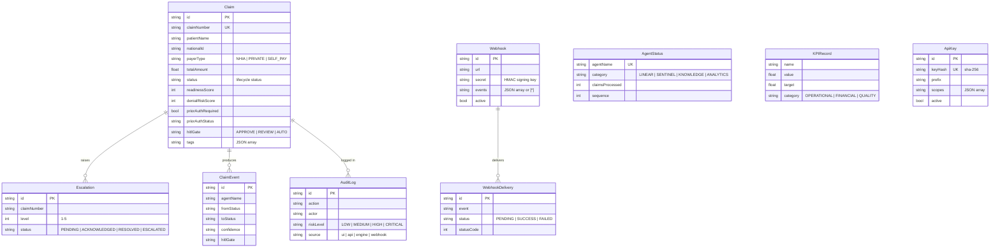
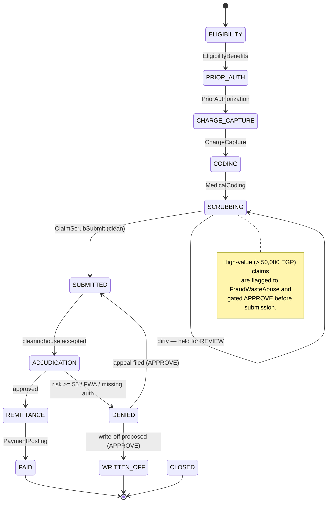
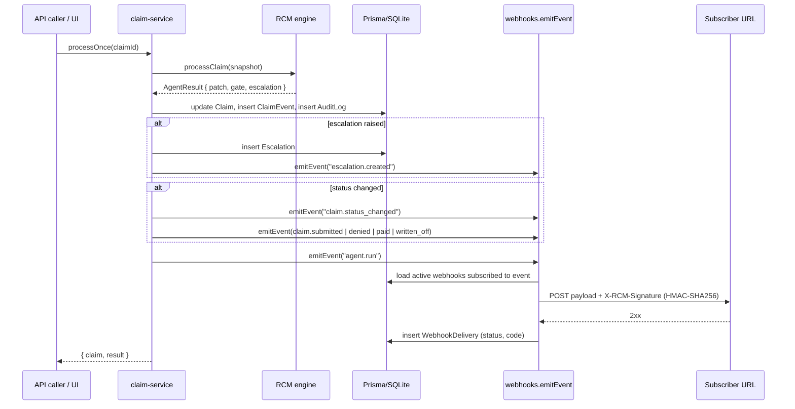
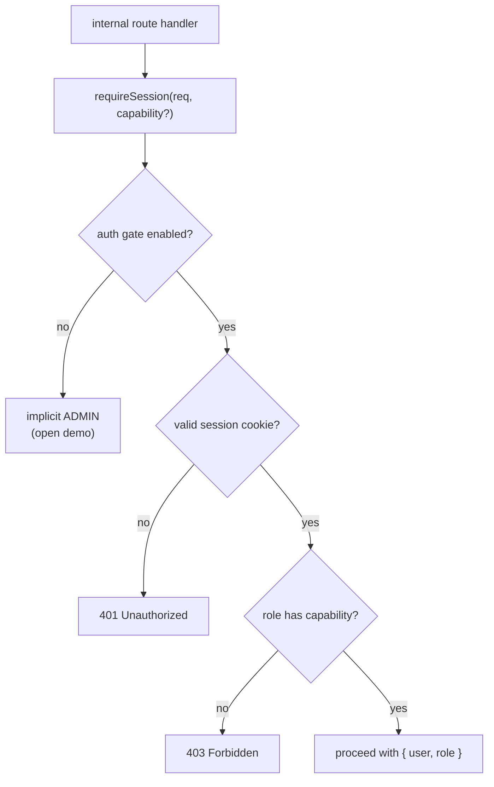

# Architecture

This document describes the system architecture of the **Veebase RCM Intelligence Platform**: the layering, the data model, the claim lifecycle state machine, the engine's scoring and payer rules, the Human-in-the-Loop (HITL) governance model, and the event/webhook flow.

## Table of Contents

- [Layers](#layers)
- [Data Model](#data-model)
- [Claim Lifecycle State Machine](#claim-lifecycle-state-machine)
- [Engine Scoring](#engine-scoring)
- [Payer Rule Book](#payer-rule-book)
- [Human-in-the-Loop Governance](#human-in-the-loop-governance)
- [Event & Webhook Flow](#event--webhook-flow)
- [AI Provider Layer](#ai-provider-layer)
- [AuthN / AuthZ](#authn--authz)
- [Encryption-at-Rest & Shared Store](#encryption-at-rest--shared-store)

---

## Layers

The platform separates a **pure engine** from a **side-effecting service layer**, behind an **API layer** consumed by the **UI**.



**Design principle.** `src/lib/rcm-engine.ts` is a **pure function module**: `processClaim(claim)` takes a claim snapshot and returns an `AgentResult` (the proposed status change, scores, rationale, HITL gate, optional escalation, and a field-level `patch`). It performs no I/O. The service layer (`src/lib/server/claim-service.ts`) applies the patch to the database, records a `ClaimEvent`, writes the audit log, and dispatches webhook events. This keeps the engine deterministic and unit-testable.

---

## Data Model

The Prisma models in `prisma/schema.prisma`. SQLite is the default provider; the data layer is provider-agnostic — `scripts/switch-db.sh sqlite|postgresql|mysql` retargets it at a managed database with no code changes (see the README environment-variable notes). Beyond the claim/agent/webhook core below, three models support auth and reliability: **User** (RBAC), **Setting** (runtime key/value config, e.g. the selected AI provider), and **IdempotencyKey** (cross-instance safe retries).



### Model reference

| Model | Purpose | Key fields |
|-------|---------|-----------|
| **Claim** | The central record driven through the pipeline. | `claimNumber` (unique), `patientName`, `nationalId`, `payerType` (`NHIA`/`PRIVATE`/`SELF_PAY`), `totalAmount`, `status`, `readinessScore`, `denialRiskScore`, `priorAuthRequired`, `priorAuthStatus`, `submittedAt`, `filingDeadline`, `appealDeadline`, `paidAmount`, `patientResponsibility`, `phase`, `hitlGate`, `currentAgent`, `tags` (JSON). |
| **AgentStatus** | Operational status of each of the 12 agents. | `agentName` (unique), `displayName`, `category`, `status`, `claimsProcessed`, `activeClaims`, `errorCount`, `avgProcessingMs`, `sequence`. |
| **Escalation** | The 5-level human escalation ladder. | `claimNumber`, `level` (1–5), `reason`, `agentName`, `status`, `assignedTo`, `resolvedAt`, `tags`. |
| **KPIRecord** | Revenue-cycle KPIs. | `name`, `value`, `target`, `unit` (`pct`/`days`/`EGP`/`count`), `category`, `period`, `trend`. |
| **AuditLog** | Immutable compliance audit trail. Indexed on `claimId`, `action`, `timestamp`. | `action`, `actor`, `actorRole`, `claimNumber`, `agentName`, `details`, `previousValue`, `newValue`, `riskLevel`, `tags`, `source`. |
| **ClaimEvent** | Per-agent processing output recorded each time an agent runs. Indexed on `claimId`, `agentName`. | `agentName`, `fromStatus`, `toStatus`, `confidence`, `rationale`, `recommendedAction`, `hitlGate`, `escalationRequired`, `output` (JSON). |
| **ApiKey** | Inbound API keys. | `keyHash` (unique SHA-256), `prefix`, `scopes` (JSON), `active`, `lastUsedAt`. |
| **Webhook** | Outbound subscriptions. | `url`, `secret`, `events` (JSON or `["*"]`), `active`, `description`. |
| **WebhookDelivery** | Delivery log per attempt. Cascade-deleted with its `Webhook`. Indexed on `webhookId`, `status`. | `event`, `payload`, `status`, `statusCode`, `responseBody`, `attempts`, `deliveredAt`. |
| **User** | RBAC user accounts for the optional sign-in gate. | `email` (unique), `name`, `passwordHash` (scrypt), `role` (`ADMIN`/`RCM_MANAGER`/`BILLER`/`COMPLIANCE`/`VIEWER`), `active`, `lastLoginAt`. |
| **Setting** | Runtime key/value app settings persisted in the DB. | `key` (PK), `value` — e.g. `ai.provider` holds the runtime-selected AI provider. |
| **IdempotencyKey** | Cached responses so external systems can safely retry create requests across instances. | `key` (unique), `scope` (default `claim.create`), `claimId`, `response` (cached JSON). |

---

## Claim Lifecycle State Machine

A claim moves through nine forward stages, with branches to `DENIED` and `WRITTEN_OFF`. Each stage is owned by an agent (`STAGE_AGENT` in `rcm-engine.ts`).



**Stage ownership and notable branch logic** (from `rcm-engine.ts`):

| From status | Agent | Branch logic |
|-------------|-------|--------------|
| `ELIGIBILITY` | EligibilityBenefits | Self-pay → patient responsibility set to full amount. Determines whether prior auth is required (amount ≥ payer threshold). |
| `PRIOR_AUTH` | PriorAuthorization | Auth required but no auth number → `REVIEW` + Level-2 escalation (`MISSING_AUTH`). |
| `CHARGE_CAPTURE` | ChargeCapture | Amount > 20,000 EGP and not a clean claim → `MISSING_CHARGES` tag + `REVIEW`. |
| `CODING` | MedicalCoding | Low-confidence (missing charges or amount > 30,000 EGP) → `CODING_REVIEW` + `REVIEW` (auto-accept prohibited). |
| `SCRUBBING` | ClaimScrubSubmit | Any edit (`AUTH_MISMATCH`, `CHARGE_GAP`, `CODE_REVIEW_PENDING`) → held at `SCRUBBING` (`REVIEW`). Clean → `SUBMITTED`; amount > 50,000 EGP → `APPROVE` + Level-4 FWA escalation; sets `submittedAt`, `filingDeadline`, `expectedResponseBy`. |
| `SUBMITTED` | ClaimScrubSubmit | Clearinghouse accept → `ADJUDICATION`. |
| `ADJUDICATION` | PaymentPosting / DenialPrediction | `denialRisk ≥ 55` OR `FWA_FLAG` OR (auth required & not approved) → `DENIED` (`REVIEW`) + Level-3 escalation, set `appealDeadline`. Else → `REMITTANCE`. |
| `REMITTANCE` | PaymentPosting | Posts `paidAmount = totalAmount × reimbursementRate`, sets patient responsibility → `PAID`. |
| `DENIED` | DenialManagement | Within appeal window and amount ≥ 1,000 EGP → appeal filed → `SUBMITTED` (`APPROVE`). Else → `WRITTEN_OFF` proposed (`APPROVE`) + Level-3 escalation. |
| `PAID` / `CLOSED` / `WRITTEN_OFF` | — | Terminal — no further automated processing. |

---

## Engine Scoring

Two scores are recomputed after every step by `finalize()`.

### Readiness score (`computeReadiness`)

0–100, higher = cleaner. Starts at **70** and adjusts:

| Condition | Δ |
|-----------|----|
| Prior auth required, number on file & `APPROVED` | +15 |
| Prior auth required, status `PENDING` | −10 |
| Prior auth required, otherwise | −20 |
| No prior auth required | +10 |
| Amount > payer prior-auth threshold but auth not flagged | −8 |
| Tag `MISSING_CHARGES` | −15 |
| Tag `CODING_REVIEW` | −8 |
| Tag `CLEAN_CLAIM` | +12 |
| Filing deadline < 7 days | −12 |
| Filing deadline < 15 days | −5 |

Result is clamped to 0–100.

### Denial-risk score (`computeDenialRisk`)

0–100, higher = riskier. Starts at the payer's **denial baseline** and adjusts:

| Condition | Δ |
|-----------|----|
| Prior auth required and not `APPROVED` | +25 |
| Amount > 2× payer prior-auth threshold | +15 |
| Tag `DENIAL_RISK_HIGH` | +20 |
| Tag `FWA_FLAG` | +25 |
| Tag `MISSING_CHARGES` | +12 |
| Tag `CODING_REVIEW` | +10 |
| Tag `CLEAN_CLAIM` | −10 |
| Readiness ≥ 85 | −8 |

Result is clamped to 0–100. At adjudication, a claim is **denied** when `denialRisk ≥ 55`, or it carries an `FWA_FLAG`, or it required prior auth that was never approved.

---

## Payer Rule Book

A compact, deterministic per-payer rule set (`PAYER_RULES`). In production these would be sourced from the `PayerContractRules` knowledge agent / contract DB.

| Payer type | Prior-auth threshold (EGP) | Timely-filing window (days) | Appeal window (days) | Reimbursement rate | Denial baseline |
|------------|---------------------------:|----------------------------:|---------------------:|-------------------:|----------------:|
| **NHIA** | 5,000 | 90 | 30 | 0.90 | 8 |
| **PRIVATE** | 3,000 | 60 | 45 | 0.85 | 12 |
| **SELF_PAY** | ∞ (n/a) | 365 | 0 | 0.00 | 0 |

These values drive eligibility (`priorAuthRequired = amount ≥ threshold` for non-self-pay), the `filingDeadline` at submission (`serviceDate + filingDays`), the `appealDeadline` at denial (`now + appealDays`), the allowed/posted amount at payment (`totalAmount × reimbursementRate`), and the baseline of the denial-risk score.

---

## Human-in-the-Loop Governance

Every `AgentResult` carries a `hitlGate`:

| Gate | Meaning |
|------|---------|
| `AUTO` | Safe to advance automatically. |
| `REVIEW` | A human must review before the claim proceeds. |
| `APPROVE` | A human must explicitly approve a sensitive action. |

**Auto-processing stops at any human gate.** `processToGate()` (in `claim-service.ts`) loops `processOnce()` but **breaks** as soon as a step returns a gate other than `AUTO`, reaches a terminal status, hits the safety cap (`maxSteps = 12`), or is held (from-status equals to-status, e.g. a dirty scrub). This guarantees nothing prohibited by policy is auto-executed.

**Phase-1 prohibited actions** (never performed automatically; defined in `PROHIBITED_ACTIONS` and enforced by the engine):

| Rule | Enforcement in the engine |
|------|---------------------------|
| **No auto-accept of low-confidence coding** | `runCoding` sets `REVIEW` and tags `CODING_REVIEW` for low-confidence coding (must be signed off by a certified coder). |
| **No auto write-off** | `runDenialManagement` proposes a write-off with gate `APPROVE` and a Level-3 escalation — never executed without human approval. |
| **No submitting a dirty claim** | `runScrub` holds the claim at `SCRUBBING` with `REVIEW` whenever any scrubber edit is present. |
| **High-value claims flagged to FWA** | `runScrub` tags `FWA_FLAG` and raises a Level-4 escalation for claims > 50,000 EGP, gating submission to `APPROVE`. |
| **No auto-escalate to Level 5** | Level-5 (Medical Director) escalations require compliance review / manual escalation. |
| **No suppression of fraud flags** | FWA sentinel flags cannot be dismissed without documented compliance sign-off. |

Each step is also written to the **immutable audit trail** (`AuditLog`) with the agent, before/after status, a risk level derived from the gate (`APPROVE`→`HIGH`, `REVIEW`→`MEDIUM`, `AUTO`→`LOW`), and `source: engine`.

---

## Event & Webhook Flow

When the service layer mutates a claim it emits events to all active, subscribed webhooks (`emitEvent` in `src/lib/server/webhooks.ts`). Delivery is **fire-and-forget** (never blocks the caller) and every attempt is logged to `WebhookDelivery`.



**Emitted events** (`RcmEvent`): `claim.created`, `claim.updated`, `claim.status_changed`, `claim.submitted`, `claim.denied`, `claim.paid`, `claim.written_off`, `escalation.created`, `escalation.resolved`, `agent.run`.

**Delivery headers** on each POST:

| Header | Value |
|--------|-------|
| `X-RCM-Event` | The event name. |
| `X-RCM-Signature` | `sha256=` + HMAC-SHA256 of the raw request body, keyed with the webhook's signing secret. |
| `X-RCM-Delivery` | A unique delivery (envelope) id. |

The payload envelope is `{ id, event, timestamp, data }`. Subscribers verify authenticity by recomputing the HMAC over the raw body with their stored secret and comparing it to `X-RCM-Signature`. The delivery request times out after 8 seconds.

See [`INTEGRATION.md`](INTEGRATION.md) for the full webhook subscription flow and a Node.js signature-verification snippet.

---

## AI Provider Layer

The chat (LLM) and PDF-extraction (VLM) features are decoupled from any single vendor by a small **provider router** (`src/lib/ai`). It has three parts:

- **`config.ts`** — builds a `ProviderConfig` for each provider (`zai`, `openai`, `anthropic`, `ollama`) from env, marks whether each is `configured`, and resolves the env-declared primary (`RCM_AI_PROVIDER`) and fallback chain (`RCM_AI_FALLBACKS`).
- **`providers.ts`** — the per-vendor call implementations (the bundled z.ai SDK, an OpenAI-compatible `fetch`, and the Anthropic Messages API). Each throws on failure so the router can fall through.
- **`index.ts`** — the router. It reads the **active** provider (runtime-switchable, persisted in the `Setting` table under `ai.provider`, default from env), assembles an ordered, de-duplicated chain `[active, ...fallbacks]`, and tries each configured provider in turn.

```mermaid
flowchart TD
    Req["aiChat / aiVision request"] --> Active{active provider<br/>(Setting · ai.provider)}
    Active --> P1["try active provider"]
    P1 -- ok --> R["AIResult { text, provider, model }"]
    P1 -- throws --> P2["try next fallback…"]
    P2 -- ok --> R
    P2 -- all fail --> Null["return null →<br/>caller uses deterministic<br/>knowledge-base fallback"]
```

`aiChat` / `aiVision` return `{ text, provider, model }` on success or `null` when every configured provider fails — callers (`/api/chat`, `/api/ingest`) then use their deterministic domain fallback, so the feature never hard-fails. The control plane (`GET/POST /api/ai`, `POST /api/ai/test`) lists providers, switches the active one (gated by the `ai.manage` capability), and runs connectivity tests.

---

## AuthN / AuthZ

The optional UI auth gate combines **session cookies** with an **RBAC capability matrix**.

- **AuthN.** `POST /api/auth/login` authenticates against the `User` table (matched by email or name, scrypt-hashed passwords via `src/lib/server/passwords.ts`), falling back to the env single-user as an ADMIN when no users exist. On success it issues a signed HttpOnly session cookie carrying `{ user, role }` (`src/lib/server/session.ts`).
- **AuthZ.** `src/lib/server/rbac.ts` maps each of the five roles to a set of capabilities; routes and the UI check *capabilities*, not roles. `requireSession(request, capability?)` is the guard for internal route handlers — it returns **401** with no valid session and **403** when the role lacks the required capability. When the gate is disabled, the guard returns an implicit ADMIN so the open demo keeps working.



Capability checks back the AI control plane (`ai.manage`), user management (`users.manage`), and other sensitive routes. `GET /api/auth/session` exposes `{ authEnabled, user, role, capabilities }` so the UI can hide/disable actions the role cannot perform.

---

## Encryption-at-Rest & Shared Store

Two infrastructure concerns are abstracted so they can be enabled per deployment without touching call sites.

- **PHI encryption-at-rest** (`src/lib/server/crypto-field.ts`). When `RCM_ENCRYPTION_KEY` is set, sensitive fields (national IDs) are encrypted with **AES-256-GCM** (random 12-byte IV per value) and stored as `enc:1:<iv>:<tag>:<ciphertext>`. `decryptField` transparently passes through plaintext, so enabling encryption is backward compatible with existing rows; the API returns decrypted values. A `redactPII` helper masks 14-digit IDs in logs.
- **KV / shared store** (`src/lib/server/kv.ts`). A tiny `KVBackend` abstraction provides `incrWithExpiry` for rate-limit counters. The default backend is **in-memory** (per process); setting `REDIS_URL` swaps in a **Redis** backend (via the dynamically-imported, optional `ioredis`) so counters are shared across instances for horizontal scale-out. Idempotency is handled separately by the `IdempotencyKey` model in the primary database, which is already shared across instances.
